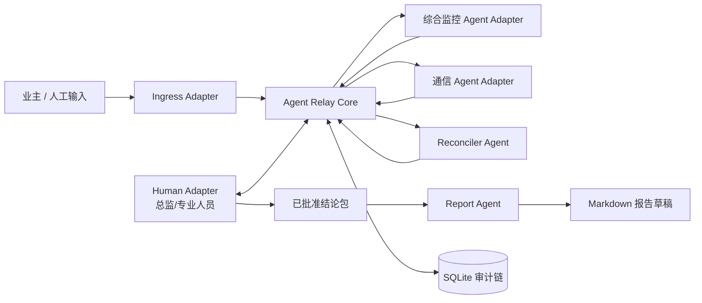

# 工程协同 Agent Relay：MVP 技术设计

## 1. 设计目标

MVP 用一个本地、可断网演示的参考实现，验证“异构 Agent 与人工节点可以通过统一消息协作”的技术假设。它验证协议、状态和人工控制，不验证真实企业系统接入。

## 2. 逻辑架构



### 模块边界

| 模块 | 责任 | 不负责 |
| --- | --- | --- |
| Ingress Adapter | 把外部信息转换为标准消息 | 判断专业结论 |
| Relay Core | 路由、轮次、状态、审计、阻断越权动作 | 替代专业判断 |
| Agent Adapter | 在各角色上下文内处理任务并返回结构化结果 | 批准正式结论 |
| Human Adapter | 观察、补充、纠偏、暂停、退回、批准 | 处理所有低风险整理工作 |
| Reconciler Agent | 汇聚事实、证据、冲突和建议结论 | 自动签发 |
| Report Agent | 从已批准结论包生成草稿 | 接收未经确认的聊天内容 |

## 3. MVP 技术选择

| 层次 | 选择 | 理由 |
| --- | --- | --- |
| 运行时 | Python 3.9+ | 当前机器已具备；适合脚本、数据模型与状态机 |
| 消息模型 | `dataclasses` + JSON | 轻量、可审阅、可序列化 |
| Relay | 进程内同步路由 | 角色少、最多两轮，不需要消息队列 |
| 审计 | SQLite | 单文件、零部署、可按 `trace_id` 回放 |
| Demo 数据 | JSON fixtures | 脱敏、可版本控制、断网可用 |
| Agent 节点 | Mock 规则与预设结构化响应 | 优先验证协同协议，不依赖 API |
| 观察面板 | Streamlit；CLI 为保底 | 让非技术观众看见状态、证据和人工操作 |
| 报告 | Markdown | 先验证从确认结论到交付草稿的链路 |

不在 MVP 引入 FastAPI、Redis、PostgreSQL、Docker、真实渠道 SDK 或重型多 Agent 框架。

## 4. 角色与权限

| 角色 | 输入 | 输出 | 权限 |
| --- | --- | --- | --- |
| 业主/发起方 | 质疑、要求、补充说明 | 问题消息 | 可发起或补充，不可批准 |
| Relay 编排角色 | 问题与规则 | 任务拆分、澄清请求 | 可路由，不可签发 |
| 综合监控专业 Agent | 专业证据和规则 | 专业结论、证据引用 | 仅专业建议 |
| 通信专业 Agent | 专业台账和规则 | 专业结论、证据引用 | 仅专业建议 |
| 汇总 Agent | 已回传的结构化结果 | 建议结论、冲突清单 | 仅建议 |
| 总监 Human Adapter | 全部可见审计链 | 纠正、暂停、退回、批准 | 唯一最终确认节点 |
| 报告 Agent | 已批准结论包 | Markdown 草稿 | 不可改写事实 |

## 5. 最小消息契约

```json
{
  "message_id": "msg-001",
  "trace_id": "sc-pipe-001",
  "round": 1,
  "sender": {"role": "supervisor", "adapter": "mock"},
  "receiver": {"role": "integrated_monitoring", "adapter": "mock"},
  "event_type": "verification.requested",
  "payload": {"task": "核对对象、壁厚和适用依据"},
  "evidence_refs": [],
  "requires_human_approval": false,
  "status": "delivered",
  "timestamp": "2026-08-02T12:00:00+08:00"
}
```

必需字段：

- `trace_id`：同一工程事项的唯一追踪标识。
- `round`：当前协作轮次，防止无限对话。
- `sender`、`receiver`：角色与 Adapter 身份，不绑定具体厂商。
- `event_type`：说明消息的协作意图。
- `evidence_refs`：结论必须能回到来源材料或模拟证据。
- `requires_human_approval`：显式标出不能自动越过的责任节点。

初版事件类型：

```text
issue.created
verification.requested
evidence.submitted
clarification.requested
human.correction
conclusion.proposed
human.approval
report.drafted
```

## 6. 轮次与状态控制

自动 Agent 处理上限为两轮；`Round 0` 仅用于创建事项，不计入两轮：

```text
Round 0: 创建事项并拆分任务
Round 1: 并行收集专业证据
Round 2: 仅在缺证据、对象歧义或专业冲突时定向澄清
```

状态机：

```text
NEW
-> DISPATCHED
-> EVIDENCE_COLLECTING
-> CLARIFICATION_REQUIRED (可选)
-> RECONCILED
-> HUMAN_CONFIRMATION
-> APPROVED -> REPORT_DRAFTED

RETURNED / INSUFFICIENT_EVIDENCE 为终止或回退状态。
```

每轮结束时 Relay 检查：是否所有必需角色回复、是否有证据、是否存在冲突、是否收到人工暂停或纠正、是否已达到轮次上限。若仍无法完成，则进入 `INSUFFICIENT_EVIDENCE`，不生成正式结论。

## 7. 人工控制

人工不是只在末尾点击批准。Demo 的最小权限如下：

| 人工角色 | 可发出的消息 |
| --- | --- |
| 专业人员 | `human.note`、`human.correction`、`human.evidence` |
| 专业负责人 | 上述消息，以及 `human.pause` |
| 总监 | 上述消息，以及 `human.approval`、`human.return` |

消息类型：

```text
human.note        补充说明
human.correction  纠正对象、标准或事实
human.evidence    增加证据
human.pause       暂停当前事项
human.approval    批准建议结论
human.return       退回补充
```

人工消息与 Agent 消息进入同一条审计链。高优先级纠正会使相关结论失效，并重新触发定向核查；只有 `human.approval` 后才会生成“已批准结论包”并交给 Report Agent。

## 8. MVP 与未来的分界

| 现在的本地 MVP | 后续方向 |
| --- | --- |
| Mock Adapter | Codex CLI、Hermes、其他 Agent Adapter |
| 单机进程内 Relay | 各节点 Gateway 通过安全协议互联 |
| SQLite | 多节点审计库与权限控制 |
| JSON fixtures | 企业 IM、邮件、文件和项目系统入口 |
| Markdown 草稿 | 受控的 Word/PDF 与正式归档流程 |

MVP 不对任何外部产品的 API、协议或兼容性作出未经验证的承诺。
